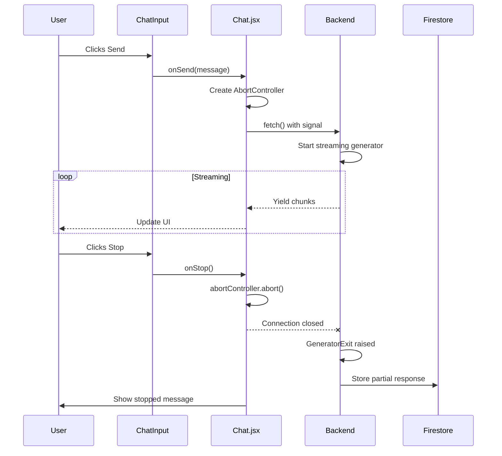
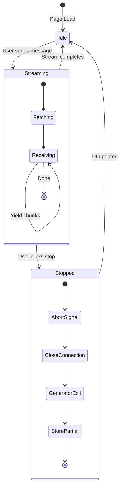

# Stream Abort Mechanism

Technical documentation for DB-Genie's stream cancellation feature.

---

## Overview

Allows users to stop AI response generation mid-stream by clicking the stop button.

---

## Architecture Flow



---

## Component Breakdown

### 1. Frontend - ChatInput.jsx

```jsx
// Props
isStreaming: boolean  // Controls button appearance
onStop: function      // Callback to abort

// Button logic
<IconButton
  type={isStreaming ? 'button' : 'submit'}
  onClick={isStreaming ? onStop : undefined}
>
  {isStreaming ? <StopIcon /> : <SendIcon />}
</IconButton>
```

---

### 2. Frontend - Chat.jsx

```jsx
// AbortController ref
const abortControllerRef = useRef(null);

// Create on send
abortControllerRef.current = new AbortController();

// Attach to fetch
fetch('/api/chat', {
  signal: abortControllerRef.current.signal
});

// Stop handler
const handleStopStreaming = () => {
  abortControllerRef.current?.abort();
};

// Error handling
catch (error) {
  if (error.name === 'AbortError') {
    // Mark as stopped, not error
    message.wasStopped = true;
  }
}
```

---

### 3. Backend - conversation_service.py

```python
was_aborted = False

try:
    for chunk in responses:
        yield chunk
        
except GeneratorExit:
    # Frontend closed connection
    was_aborted = True
    
finally:
    # Always runs - stores partial response
    if was_aborted:
        response_text += "\n\n_(Response stopped by user)_"
    FirestoreService.store_conversation(...)
```

---

## State Flow



---

## Key Files

| File | Role |
|------|------|
| `front-end/src/components/ChatInput.jsx` | Stop button UI |
| `front-end/src/pages/Chat.jsx` | AbortController logic |
| `back-end/services/conversation_service.py` | GeneratorExit handling |

---

## Data Flow Summary

1. **User clicks Stop** → `onStop()` called
2. **AbortController.abort()** → Signal fired
3. **Fetch throws AbortError** → Caught in Chat.jsx
4. **Connection closes** → Backend receives broken pipe
5. **GeneratorExit raised** → Generator stops iterating
6. **Finally block runs** → Partial response + `_(Response stopped by user)_` stored
7. **UI updated** → Message marked `wasStopped: true`
