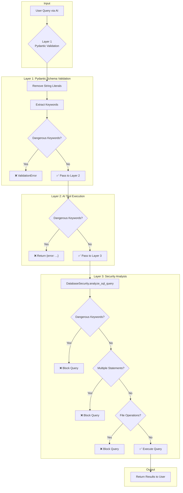

# Read-Only Query Guard (ROQG)

**Official Name:** Read-Only Query Guard (ROQG)  
**Purpose:** Database-agnostic security layer for SQL query validation

---

## Overview

ROQG is a multi-layer security mechanism that ensures only read-only queries can be executed through the AI assistant. It uses a **blacklist approach** instead of a whitelist, making it compatible with all major relational databases.



---

## Blacklist vs Whitelist Approach

### Previous Approach (Whitelist) ❌
```python
# Only allowed queries starting with SELECT or WITH
if not query.startswith('SELECT') and not query.startswith('WITH'):
    raise Error("Only SELECT queries allowed")
```

**Problems:**
- Rejects valid database-specific syntax (EXPLAIN, SHOW, DESCRIBE)
- Breaks cross-database compatibility
- Requires constant updates for new SQL features

### Current Approach (Blacklist) ✅
```python
# Block dangerous keywords, allow everything else
DANGEROUS = {'INSERT', 'UPDATE', 'DELETE', 'DROP', 'CREATE', 'ALTER', 'TRUNCATE'}
if any(keyword in query for keyword in DANGEROUS):
    raise Error("Write operation blocked")
```

**Benefits:**
- Database-agnostic (works with PostgreSQL, MySQL, SQL Server, Oracle, SQLite)
- Flexible (allows EXPLAIN, SHOW, CTEs, subqueries, etc.)
- Secure (blocks all mutation operations)

---

## Three-Layer Defense

| Layer | File | Purpose |
|-------|------|---------|
| **1** | `tool_schemas.py` | Pydantic validation before tool execution |
| **2** | `ai_tools.py` | Runtime check in `_execute_query()` |
| **3** | `database/security.py` | Deep security analysis |

---

## Blocked Keywords

```python
DANGEROUS_KEYWORDS = {
    'INSERT',     # Data insertion
    'UPDATE',     # Data modification
    'DELETE',     # Data deletion
    'DROP',       # Object deletion
    'CREATE',     # Object creation
    'ALTER',      # Object modification
    'TRUNCATE',   # Table truncation
    'GRANT',      # Permission granting
    'REVOKE',     # Permission revocation
    'EXEC',       # Procedure execution
    'EXECUTE'     # Procedure execution
}
```

---

## False Positive Prevention

String literals containing blocked keywords are ignored:

```python
# This is ALLOWED because 'INSERT' is inside quotes
SELECT * FROM logs WHERE message = 'Failed INSERT operation'

# Process:
# 1. Remove quoted strings: SELECT * FROM logs WHERE message = ''
# 2. Check keywords: No dangerous keywords found
# 3. Result: ✅ Query allowed
```

---

## Database Compatibility Matrix

| Query Type | PostgreSQL | MySQL | SQL Server | Oracle | Status |
|------------|:----------:|:-----:|:----------:|:------:|:------:|
| `SELECT` | ✅ | ✅ | ✅ | ✅ | Allowed |
| `WITH ... SELECT` (CTE) | ✅ | ✅ | ✅ | ✅ | Allowed |
| `(SELECT ...)` subquery | ✅ | ✅ | ✅ | ✅ | Allowed |
| `EXPLAIN SELECT` | ✅ | ✅ | ✅ | ✅ | Allowed |
| `SHOW TABLES` | N/A | ✅ | N/A | N/A | Allowed |
| `DESCRIBE table` | N/A | ✅ | N/A | ✅ | Allowed |
| `INSERT` | ❌ | ❌ | ❌ | ❌ | **Blocked** |
| `UPDATE` | ❌ | ❌ | ❌ | ❌ | **Blocked** |
| `DELETE` | ❌ | ❌ | ❌ | ❌ | **Blocked** |
| `DROP` | ❌ | ❌ | ❌ | ❌ | **Blocked** |

---

## Error Messages

When a query is blocked, the user receives a clear message:

```
Query contains blocked keywords: INSERT, UPDATE. 
Only read-only queries are allowed.
```

---

## Related Files

- [`tool_schemas.py`](file:///c:/Users/Aftab/Desktop/db-genie/back-end/services/tool_schemas.py) - Pydantic schema with `validate_query_is_read_only()`
- [`ai_tools.py`](file:///c:/Users/Aftab/Desktop/db-genie/back-end/services/ai_tools.py) - Runtime check in `_execute_query()`
- [`database/security.py`](file:///c:/Users/Aftab/Desktop/db-genie/back-end/database/security.py) - `DatabaseSecurity.analyze_sql_query()`
