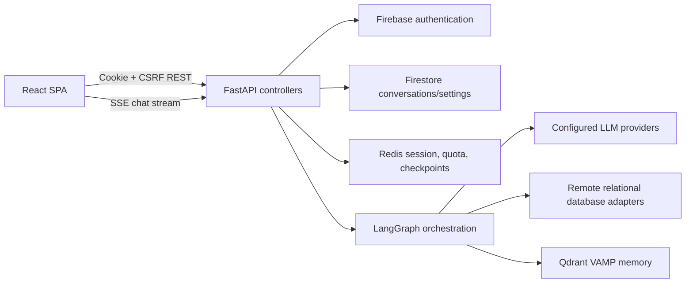
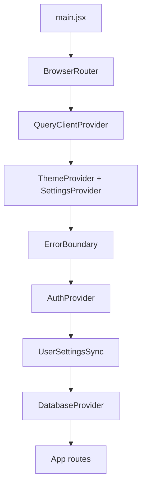
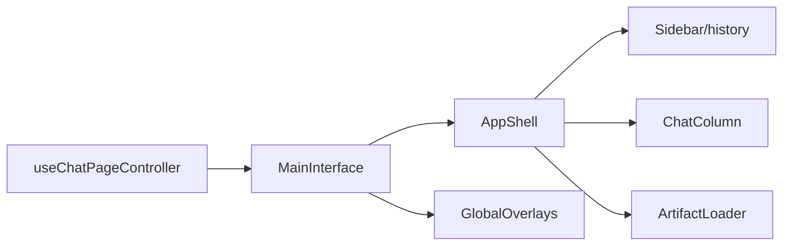
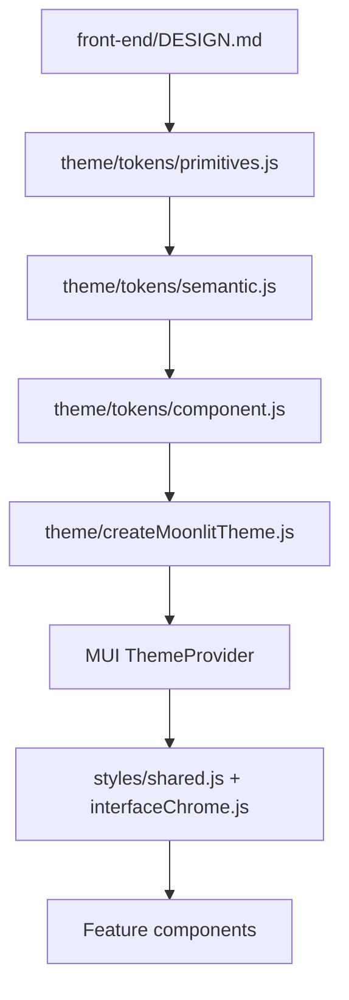

# Moonlit Architecture

## Current Architecture

### High-Level Application Flow

### Frontend Entry and Providers

- `front-end/src/main.jsx` mounts React and composes routing, React Query, theme/settings,
  error handling, authentication, user-setting sync, and database state.
- `front-end/src/App.jsx` defines lazy routes for landing, authentication, chat, and admin.
- `front-end/src/guards/ProtectedRoute.jsx` and `AdminRoute.jsx` enforce route boundaries.

### Routing

| Route | Surface | Guard |
|---|---|---|
| `/` | Landing | Public |
| `/auth` | Sign in/sign up | Public |
| `/chat` | New chat | Authenticated |
| `/chat/:conversationId` | Existing conversation | Authenticated |
| `/admin` | Administration | Administrator |

### Authenticated Application Shell

`MainInterface.jsx` is a composition root. `useChatPageController` coordinates feature hooks and
passes slots into `AppShell`.

- Desktop: animated sidebar, flexible chat column, resizable artifact column.
- Narrow layout: sidebar drawer, full-width chat, full-screen artifact overlay.
- Panel surfaces and seams are centralized in `features/styles/interfaceChrome.js`.

### Chat Component Architecture

- `ChatColumn.jsx`: owns the chat layout slots and scroll/composer positioning.
- `WelcomeScreen.jsx`: empty state, suggestions, and composer.
- `MessageList.jsx`: bounded transcript, user/assistant turns, loading/error states, artifacts.
- `ChatInput.jsx`: message input, context selection, SQL action, model selection, send/stop.
- `MarkdownRenderer.jsx`: Markdown/GFM presentation and code-block routing.
- `CodeViewer.jsx`: Shiki-backed static and streaming code presentation.
- `ai-response-steps/*`: reasoning/tool timeline and result details.
- `InlineExecutionTable.jsx`: fetched execution results rendered with Material React Table.
- `GuidedConfirmationPrompt.jsx`: pause/continue interaction above the composer.

### State Management

- React context: authentication, database state, user settings/theme.
- React Query: shared request cache configuration.
- Route state: selected conversation identifier.
- Feature hooks: conversations, streaming, scrolling, sidebar, overlays, artifacts, and query
  execution.
- Component-local state: input text, anchors, copy feedback, menus, and presentation toggles.

No global client store is used. This is appropriate for the current boundaries and should not be
replaced during focused UI compliance work.

### API Integration

- `src/api/client.js` centralizes cookie credentials, CSRF headers, JSON parsing, and safe API
  errors.
- `src/api/endpoints.js` centralizes endpoint paths.
- Feature API modules expose domain operations.
- Streaming endpoints deliberately request identity encoding to prevent proxy buffering.

### Design and Theme Architecture

The layering is sound, but current code also carries a parallel light semantic mapping and a
user-selectable mode. That behavior conflicts with the canonical dark-only specification.

### Tech Stack

- React 19, React Router 7, TanStack Query 5.
- Material UI 7 and Emotion.
- Framer Motion for shell transitions.
- React Markdown, remark-gfm, and Shiki for response rendering.
- CodeMirror for SQL editing.
- React Flow/Dagre and Perspective for artifacts.
- Firebase Web SDK for authentication.

## Important Architectural Decisions

- The application root prevents document scrolling; individual panels own scrolling.
- `MainInterface` is orchestration-only while feature hooks own behavior.
- Theme primitives, semantic roles, and component overrides are centralized.
- Heavy artifact features are lazy-loaded or isolated into build chunks.
- Conversation rendering caps initially visible messages for long transcripts.
- The authenticated shell changes topology at the configured desktop breakpoint.

## Known Architectural Problems

- Theme selection supports a mode forbidden by the current design contract.
- The MUI breakpoint map uses `md: 960`, while the canonical primary design transition is 768px.
- Design spacing is a 4px scale, while the MUI theme uses an 8px spacing function and components
  often rely on fractional multipliers.
- Several large chat and sidebar files combine many presentation concerns, increasing review risk.
  They should only be split when a phase requires it and an isolated boundary is clear.
- Chat visual regression coverage is not currently automated.
- Root `README.md` describes older libraries and capabilities in places; actual code is the source
  of truth for implementation details.

## Recommended Improvements

These are scoped recommendations, not current architecture:

1. Enforce one canonical dark theme and remove the light-mode selection path.
2. Correct theme values and component overrides before local component fixes.
3. Route all chat geometry, typography, surfaces, and interaction states through approved tokens.
4. Align shell breakpoint behavior with the canonical 768px transition without altering desktop
   business behavior.
5. Add focused tests for theme mode, chat state rendering, composer interactions, transcript
   semantics, and responsive topology.
6. Reintroduce light mode only after a future approved `DESIGN.md` extension defines it.
