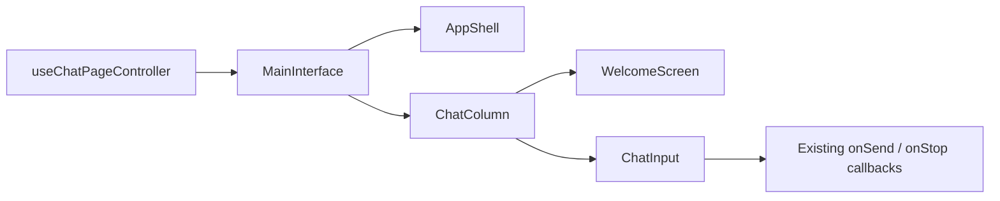

# Phase 1B Chat Shell and Composer Compliance Design

## Status

Approved by the user on 2026-08-15. Detailed implementation planning is authorized; production
implementation remains gated on selection of the execution workflow.

## Objective

Bring Moonlit's authenticated chat shell, empty state, composer, and primary responsive topology
into compliance with `front-end/DESIGN.md` without changing chat behavior, state management,
backend contracts, or the existing component boundaries.

## Source of Truth

- `front-end/DESIGN.md` is authoritative and must not be modified.
- Mobile is below 768px; desktop begins at exactly 768px.
- The default canvas is `#0a0a0a`; the text-input surface is `#1a1c20`.
- Cards and text inputs use an 8px radius; interactive controls use a 9999px pill radius.
- Mobile interactive targets are at least 44px by 44px.
- Spacing uses the documented 4px-derived scale.
- Typography uses the existing Inter and Geist Mono stacks at weight 400.

## Approved Approach

Use a token-led targeted correction:

1. Change the global MUI `md` breakpoint from 960px to 768px.
2. Map the semantic composer surface to the canonical `canvas-soft` value, `#1a1c20`.
3. Route the welcome heading through the existing `uiDisplaySm` typography role instead of local
   font-size overrides.
4. Correct only verified chat-shell geometry, spacing, and mobile-target gaps.
5. Extend executable design audits before changing production behavior.

This is preferred over component-local overrides because responsive and surface rules would remain
duplicated. It is preferred over a broad chat styling refactor because the current component and
data-flow boundaries are sound and the repository already contains a large staged change set.

## Architecture

Preserve the existing composition:

- `useResponsive()` derives mobile/tablet/desktop state from MUI breakpoints.
- `MainInterface` wires controller state into layout slots.
- `AppShell` selects narrow or desktop topology and paints column surfaces.
- `ChatColumn` composes the empty state, transcript, composer, and narrow sidebar entry.
- `WelcomeScreen` owns the empty-state heading and suggestion actions.
- `ChatInput` owns message entry, context and model controls, send/stop behavior, and slash commands.
- Theme primitives map to semantic tokens, then shared chrome helpers and component styles.

No new provider, hook, store, component hierarchy, styling library, or dependency is required.

## Responsive Contract

The global breakpoint map becomes:

```js
{ xs: 0, sm: 600, md: 768, lg: 1200, xl: 1536 }
```

This makes existing `up('md')`, `down('md')`, and responsive `md` values agree on one boundary.

### Below 768px

- `AppShell` renders the narrow single-chat-column topology.
- Sidebar content is presented through its drawer.
- Workspace artifacts use the existing full-screen overlay.
- The chat sidebar-entry button is visible and has a 44px pill target.
- Welcome suggestions and composer toolbar controls have 44px minimum targets.
- Settings and Database surfaces use their existing mobile topology.

### At and Above 768px

- `AppShell` renders the existing desktop columns.
- Sidebar collapse/expand and artifact panel width behavior remain unchanged.
- Settings and Database surfaces use their existing desktop topology.
- Compact pointer controls may retain the existing 34–40px visual height.

Because the breakpoint is global, validation must include the sidebar, Settings, and Database modal
at 767px and 768px in addition to the chat shell.

## Surface and Geometry

### Chat Canvas

- Continue using `background.default` (`#0a0a0a`) for shell and chat-column canvases.
- Preserve flat surfaces and the existing no-shadow contract.

### Composer

- Keep `background.composer` as a semantic role, but map it to `#1a1c20`.
- Preserve the 1px idle hairline border, 8px radius, and no-shadow states.
- Preserve multiline growth, maximum six rows, toolbar overflow, slash-menu anchoring, and safe-area
  padding.
- Normalize local spacing to values that resolve to 4px increments: 4px/8px outer horizontal
  padding, 8px desktop bottom padding, 12px mobile inner padding, and 16px desktop inner horizontal
  padding.

### Interactive Controls

- Context, SQL, model, suggestion, send/stop, scroll-to-latest, and sidebar-entry actions are pills.
- The sidebar-entry control changes from its current 10px radius to 9999px.
- Suggestion chips use a 44px height below 768px and the existing compact 34px height from 768px.
- Existing compliant toolbar and send/stop pills remain unchanged unless spacing must be adjusted to
  the canonical scale.
- Focus remains a visible 2px ring and essential actions remain available without hover.

## Empty-State Typography and Spacing

- The greeting uses `uiDisplaySm`: 28px below 768px and 32px from 768px, weight 400, 1.125 line
  height, and `-0.6px` letter spacing.
- Remove the local 26.4/32.8/40.8px font-size ladder and redundant `uiDisplayMd` override.
- Keep the greeting monochrome and preserve the current personalized copy.
- Normalize the main welcome stack gap to 16px below 768px and 24px from 768px.
- Normalize suggestion spacing to 8px while preserving wrapping and centered alignment.
- Preserve reduced-motion handling and the current short reveal animation for users who permit
  motion.

## State and Data Flow

No data-flow changes are permitted. Existing state continues through:



The following behavior remains unchanged:

- Enter submits and Shift+Enter inserts a newline.
- Empty input disables Send.
- Ready input uses the existing high-contrast Send action.
- Streaming replaces Send with the existing semantic Stop action.
- Context, SQL, model selection, task-mode commands, and usage indicators retain current behavior.
- Database prerequisites, conversation navigation, sidebar actions, and artifact behavior remain
  unchanged.

## Accessibility and UI States

- Preserve semantic buttons, labels, landmarks, and form submission.
- Preserve keyboard operation and visible focus rings.
- Preserve explicit empty, disabled, loading, streaming, and error states.
- Mobile targets must be at least 44px in both dimensions.
- Horizontal toolbar overflow must not obscure Send/Stop or model selection.
- Welcome content must remain scrollable at short viewport heights and with long names.
- Reduced-motion media queries must continue disabling nonessential reveal and label-travel motion.

## Testing Strategy

### Automated Contract Tests

Extend the existing interaction audit to assert:

- `BREAKPOINTS.values.md === 768`.
- `background.composer === '#1a1c20'`.
- Composer background, 8px radius, hairline border, and no-shadow states.
- Welcome typography resolves through `uiDisplaySm` without a local custom font-size ladder.
- Sidebar-entry, suggestion, toolbar, and send/stop control geometry uses pill radii.
- Mobile suggestion and composer controls expose 44px target dimensions.
- Local spacing values introduced by this phase resolve to the documented 4px scale.

Use Node's built-in test runner or the existing executable audit pattern; do not add a test
framework solely for this phase.

### Regression Validation

Run focused tests and audits first, followed by ESLint, Knip, and the production build. Preserve the
known Perspective chunk warning as a documented pre-existing limitation.

### Browser Matrix

Check the authenticated empty chat at approximately 390px, 767px, 768px, and a desktop width:

- Correct narrow/desktop topology at the boundary.
- Greeting scale and wrapping, including the dummy user's name.
- Composer surface, border, spacing, focus, empty/ready/disabled states, and toolbar overflow.
- Suggestion wrapping and 44px mobile targets.
- Sidebar drawer entry below 768px and desktop sidebar at 768px.
- Settings and Database modal topology at 767px and 768px.
- Console warnings/errors and horizontal overflow.

Do not send a chat message, reset preferences, or connect a database solely to create a test fixture
without separate user authorization.

## Files Expected to Change

- `front-end/src/theme/tokens.js`
- `front-end/src/theme/tokens/semantic.js`
- `front-end/src/features/styles/interfaceChrome.js`
- `front-end/src/features/chat/WelcomeScreen.jsx`
- `front-end/src/features/chat/ChatInput.jsx`
- `front-end/src/features/chat/ChatColumn.jsx`
- `front-end/scripts/audit-theme-contrast.mjs`
- `front-end/scripts/audit-interaction-contrast.mjs`
- Focused tests only where behavior cannot be expressed honestly through the executable audits.
- `docs/frontend-ui-audit/phases.md`
- `docs/frontend-ui-audit/memory.md`

## Risks and Mitigations

- **Global breakpoint blast radius:** inspect all explicit `md` consumers and browser-check the
  sidebar, Settings, and Database modal at 767px and 768px.
- **Short viewport overflow:** verify welcome content remains vertically scrollable and the composer
  remains reachable.
- **Toolbar crowding:** preserve its horizontal overflow behavior and fixed Send/Stop group.
- **Behavior regressions in a large composer:** avoid structural refactoring and test keyboard,
  disabled, ready, streaming, popover, and slash-command paths.
- **Large staged change set:** use targeted patches, avoid bulk formatting, and do not commit
  automatically.

## Non-Goals

- Transcript, Markdown, code-block, tool-step, or agent-state restyling; those belong to Phase 1C.
- Sidebar row or history redesign; those belong to Phase 2.
- New features, copy, animations, dependencies, or visual identity.
- Backend, API, authentication, database, route, or state-management changes.
- Connecting a real database or generating conversations as visual fixtures.
- Editing `front-end/DESIGN.md`.

## Acceptance Criteria

- Global desktop begins at exactly 768px and narrow behavior ends below it.
- The composer uses `#1a1c20`, an 8px radius, a hairline border, and no shadow.
- The welcome heading uses the documented 28px/32px `uiDisplaySm` role without local type sizes.
- All Phase 1B interactive controls are pills and mobile targets are at least 44px.
- New or changed spacing uses the documented 4px-derived scale.
- Chat behavior and data flow are unchanged.
- Automated checks, lint, Knip, and build pass, apart from the documented Perspective warning.
- Browser checks confirm the boundary behavior and reachable empty/composer states without new
  console errors or horizontal overflow.
