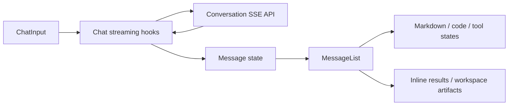

# Frontend Design-Compliance Audit Design

## Status

Approved conversational design, written for repository review on 2026-08-15. Implementation is
gated on user review of this file.

## Objective

Incrementally bring Moonlit's existing frontend into compliance with
`front-end/DESIGN.md`, beginning with the main chat experience, without redesigning the product,
changing backend behavior, or overwriting unrelated user work.

## Source of Truth

- `front-end/DESIGN.md` is authoritative and immutable.
- Current implementation is evidence, not design authority.
- Verified conflicts are corrected locally; compliant implementation remains unchanged.
- Ambiguous or harmful design requirements are escalated before implementation.

## Approved Approach

Use a foundation-first phased audit:

1. Record architecture, requirements, rules, findings, roadmap, and operational memory.
2. Enforce the canonical dark-only theme.
3. Correct the chat shell, empty state, composer, and interactions.
4. Correct transcript rendering and agent states.
5. Continue through sidebar, chat-connected surfaces, secondary pages, and final regression audit.

This approach is preferred over a chat-only patch because leaving the light theme active would
force every component to serve a mode forbidden by the canonical specification. It is preferred
over a broad token sweep because the latter would create an unnecessarily large regression radius.

## Dark Theme Decision

The user approved removing light mode now and stated that it may be introduced later. For the
current project:

- Remove the user-facing theme choice and runtime light-mode selection.
- Make dark mode authoritative on all routes.
- Remove or rewrite automated assertions that treat light mode as supported behavior.
- Avoid keeping dormant production branches solely for hypothetical future use.
- Record future light mode as a separate design-system project.

A future light theme must begin with an approved extension to `front-end/DESIGN.md` covering its
palette, surfaces, text, borders, statuses, code rendering, controls, and route behavior.

## Architecture

Preserve the current boundaries:

- Theme primitives map to semantic tokens, then MUI component overrides.
- Shared interaction and interface-chrome helpers provide reusable presentation rules.
- `MainInterface` composes slots and controller output without owning feature logic.
- `AppShell` owns desktop/narrow topology and major surfaces.
- Chat components render state supplied by existing feature hooks.
- API, streaming, authentication, database, and route behavior remain unchanged unless a UI fix
  exposes a verified existing defect that the user separately authorizes.

## Component Strategy

### Theme Foundation

Normalize the runtime to one dark design contract before component work. Prefer deletion of
obsolete light branches over compatibility abstractions. Preserve clear semantic token layers so a
future approved mode can be added intentionally.

### Chat Shell and Composer

Audit the structural surface, width, spacing, typography, control geometry, and responsive
topology. Reuse MUI theme roles and shared helpers. Controls remain semantically appropriate,
keyboard accessible, and at least 44px on touch layouts.

### Transcript and Agent States

Treat user content, assistant content, Markdown, code, tables, tool steps, artifacts, loading,
streaming, paused, and error states as one visual system. Preserve streaming order, scroll
anchoring, copying, query-result fetching, and artifact behavior.

### Sidebar and Secondary Surfaces

Audit only after the primary chat patterns are stable so shared corrections are not duplicated.
Continue phase-by-phase through the sidebar, workspace/overlays, auth/admin, landing, and final
cross-application validation.

## State and Data Flow

No state-management redesign is planned. Existing contexts, React Query, route state, and feature
hooks continue to supply the UI. Presentation fixes may derive values during render but must not
duplicate server or context state.

Chat data continues to flow as:

## Error and Accessibility Behavior

- Preserve safe user-facing errors without exposing backend internals.
- Loading, empty, streaming, paused, error, disabled, and permission states remain explicit.
- Maintain accessible names, landmarks, log/status semantics, keyboard operation, focus visibility,
  reduced motion, and touch targets.
- Essential actions may not depend exclusively on hover.
- Responsive corrections must cover long content, safe-area insets, overflow, and panel topology.

## Documentation

Maintain the following under `docs/frontend-ui-audit/`:

- `project_requirements_document.md`
- `architecture.md`
- `rules.md`
- `phases.md`
- `design.md` as a pointer only
- `memory.md`

Update memory after meaningful work and phase status after each phase transition. Documentation
must distinguish confirmed, implemented, inferred, proposed, and unknown information.

## Validation Strategy

For each implementation phase:

1. Establish or confirm the relevant baseline.
2. Add focused regression coverage where the repository can express the behavior.
3. Validate incrementally after each coherent change.
4. Review and clean every changed file.
5. Run targeted tests, lint, build, design audits, and available broader tests.
6. Perform browser checks at desktop, tablet, and mobile sizes for reachable states.
7. Report inaccessible or unverified authenticated/authorized states explicitly.

The chat browser matrix must eventually cover empty/populated conversations, long messages,
Markdown, code, tables, loading, streaming, paused/error states, composer behavior, sidebar
open/closed behavior, and scrolling.

## Risks and Mitigations

- Large staged change set: avoid unrelated edits, automatic formatting, resets, or automatic
  commits.
- Theme removal affects all routes: isolate it as Phase 1A and validate every public route plus the
  authenticated shell where accessible.
- Large chat files: make targeted edits and split only when a clear tested boundary is required.
- Missing authenticated visual access: rely on static/component checks temporarily and explicitly
  defer visual claims until a signed-in fixture is available.
- Heavy build chunks: preserve existing lazy boundaries; the Perspective warning is documented but
  outside a focused design fix unless it causes a verified UI failure.

## Non-Goals

- Editing or replacing `DESIGN.md`.
- Inventing a new visual identity.
- Implementing the future light theme.
- Backend, database, route, authentication, or orchestration redesign.
- New styling frameworks or unnecessary dependencies.
- Broad refactoring or cleanup unrelated to a verified phase issue.

## Acceptance Criteria

- Work proceeds in the documented phases with a pre-phase compliance report.
- Every changed UI behavior traces to a verified `DESIGN.md` gap or accessibility defect.
- No unapproved design deviations are introduced.
- Phase validation is executed and reported accurately.
- Operational documentation remains current.
- The final frontend uses one coherent design language without a parallel system.
