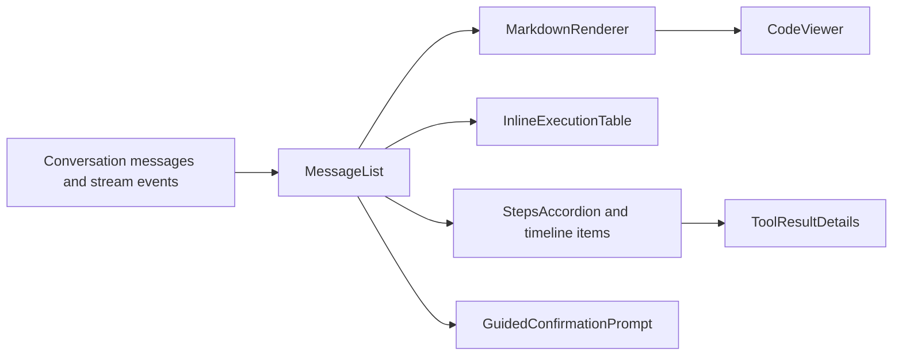

# Phase 1C Transcript, Markdown, and Agent States Compliance Design

## Status

Approved by the user on 2026-08-15. This document authorizes detailed implementation planning;
production implementation remains gated on review of this written specification.

## Objective

Bring the authenticated transcript, Markdown and code presentation, inline query results, agent
steps, and paused/error/loading states into compliance with `front-end/DESIGN.md` without changing
message data, agent execution, streaming behavior, API contracts, or component ownership.

## Source of Truth

- `front-end/DESIGN.md` is authoritative and must not be modified.
- The default canvas is `#0a0a0a`; card and input surfaces use `#191919` where that semantic role
  applies.
- Cards and text inputs use an 8px radius; interactive controls use a 9999px pill radius.
- Mobile interactive targets are at least 44px by 44px below 768px.
- User-facing spacing follows the documented 4px scale.
- Typography uses Inter and Geist Mono at weight 400.
- Focus uses a visible 2px outline; shadows are not used to communicate interaction state.

## Approved Approach

Use targeted presentation-layer corrections rather than a transcript rewrite or a development-only
fixture harness:

1. Preserve the existing transcript and agent-step component boundaries.
2. Correct verified control geometry, focus treatment, typography, and spacing violations.
3. Preserve compliant 8px content surfaces, hairline borders, semantic status colors, and
   no-shadow presentation.
4. Verify existing reachable states with the authenticated conversation and automated audits.
5. Record states that lack repeatable fixtures instead of adding production or development fixture
   routes solely for this audit.

This minimizes regression risk in streaming and tool-result code while resolving the confirmed
design-system gaps.

## Architecture

Preserve the current rendering flow:

No new provider, store, hook, parser, route, fixture page, styling library, or dependency is
required. Props, callbacks, message ordering, execution identifiers, and request behavior remain
unchanged.

## Component Design

### Message Transcript

- Keep semantic `article`, `log`, status, alert, and live-region behavior.
- Route user-message text through an existing response/body typography role rather than local
  one-off font sizes.
- Keep user-message bubbles as 8px content surfaces.
- Make message action buttons 44px pills below 768px and retain the current compact desktop size.
- Make the action-row minimum height follow the same responsive target contract.
- Preserve hover disclosure on hover-capable devices and persistent visibility on touch and
  keyboard focus.
- Preserve copy behavior, success feedback, long-content wrapping, scroll anchoring, and artifact
  opening.

### Markdown and Code

- Preserve GFM parsing, canvas-language filtering, JSON-to-SQL normalization, and code routing.
- Keep Markdown tables and code blocks as 8px, hairline, no-shadow content surfaces.
- Map full code blocks to the existing `palette.code.background`/sunken semantic role
  (`#1a1c20`) and Markdown tables to `background.paper` (`#191919`) instead of translucent
  foreground overlays.
- Preserve horizontal overflow for code and wide tables.
- Replace only verified one-off typography or user-facing spacing with existing roles and values
  resolving to the 4px scale.
- Make CodeViewer action buttons 44px pills below 768px and retain the current 28px compact desktop
  controls.
- Preserve Shiki's single static/streaming render path, syntax palette, line wrapping, copying, and
  SQL execution callbacks.
- Preserve reduced-motion handling for the streaming indicator and caret.

### Inline Query Results

- Preserve data fetching, error handling, source-order rows, virtualization thresholds, column
  resizing, and result formatting.
- Retain visual parity between Markdown tables and execution-result tables: `background.paper`
  (`#191919`), 8px radius, hairline border, tokenized header treatment, no zebra striping, and no
  shadow.
- Normalize user-facing table padding and empty/loading-state spacing to the 4px scale where current
  values do not resolve to that scale.
- Preserve readable horizontal overflow and explicit loading, empty, and error semantics.

### Reasoning and Tool Steps

- Keep collapsed-by-default reasoning behavior, current summaries, semantic status colors, and
  reduced-motion handling.
- Make reasoning accordions, expandable tool rows, and expandable schema rows at least 44px high
  below 768px, retaining their current compact desktop heights.
- Use pill geometry for interactive step controls; noninteractive timeline rows remain flat.
- Preserve outline focus treatment without focus shadows.
- Keep tool argument/result parsing, step normalization, counts, labels, expansion state, and result
  rendering unchanged.

### Guided Confirmation and Status Presentation

- Keep the confirmation prompt positioned above the composer without changing layout or callback
  behavior.
- Use an 8px attached content-surface radius and retain the current semantic warning color and
  hairline border.
- Make Stop and Continue 44px pills below 768px and retain compact desktop sizing.
- Replace the 3px focus shadow with the canonical 2px outline.
- Preserve `role="status"`, live announcements, Collapse/Fade behavior, and reduced-motion behavior
  already provided by the surrounding transition system.
- Render noninteractive progress labels as pills only when they visually function as status chips.

## Spacing Rules

Normalize spacing properties that affect visible layout—margin, padding, and gap—to values that
resolve to 4px increments. Do not mechanically alter:

- line heights or letter spacing;
- animation timing or easing;
- icon optical alignment;
- measured code line height;
- virtualization or column-width calculations;
- values whose purpose is an internal rendering calculation rather than layout rhythm.

This distinction prevents a broad mechanical rewrite while enforcing the design scale where users
perceive it.

## State and Data-Flow Contract

The implementation must not change:

- message creation, persistence, sorting, grouping, or identifiers;
- stream parsing, completion detection, or partial-content rendering;
- thinking/tool-step normalization and execution status;
- query execution, result fetching, or error payload handling;
- Markdown content transformation or recognized artifact languages;
- copy, run-query, wrap-lines, expand/collapse, confirmation, or cancellation behavior;
- composer, sidebar, database, authentication, or artifact-panel state.

## Accessibility

- Preserve semantic buttons and existing labels.
- Mobile targets are at least 44px in both dimensions below 768px.
- Focus remains visible through a 2px outline with adequate offset.
- No action may depend exclusively on hover.
- Loading uses status semantics; failures use alert semantics where already applicable.
- Streaming and agent activity retain `aria-busy` or live status treatment.
- Long Markdown, code, URLs, table cells, and tool metadata must remain readable without page-level
  horizontal overflow.
- Reduced-motion preferences continue disabling nonessential continuous and entry animations.

## Verification Strategy

### Automated Validation

Run the existing focused checks, followed by broad frontend validation:

- interaction contrast audit;
- theme contrast audit;
- dark-only audit;
- input-focus audit;
- focused source assertions only if an existing audit can express the new geometry contract without
  brittle implementation coupling;
- ESLint;
- Knip;
- production build.

Do not add a component-test framework or fixture route solely for this phase.

### Browser Validation

Use the existing authenticated schema conversation at desktop and exactly 390px to verify:

- long user and assistant messages;
- headings, lists, inline code, and long Markdown wrapping;
- message action visibility and 44px mobile geometry;
- reasoning accordion and tool-row expansion;
- artifact card and View diagram action;
- keyboard focus visibility;
- no page-level horizontal overflow;
- no new console errors.

Return the viewport to its original desktop size after responsive checks.

### Fixture Limitations

The current authenticated conversation does not provide repeatable examples of fenced code blocks,
inline execution tables, active streaming, guided confirmation, paused execution, or error states.
For those states:

- validate source-level contracts and relevant automated checks;
- do not send messages, connect a database, execute queries, or mutate user data solely to create
  screenshots;
- record the missing browser evidence in `docs/frontend-ui-audit/memory.md` and
  `docs/frontend-ui-audit/phases.md`;
- revisit browser evidence when a safe repeatable fixture becomes available.

## Files Expected to Change

- `front-end/src/features/chat/MessageList.jsx`
- `front-end/src/features/chat/MarkdownRenderer.jsx`
- `front-end/src/components/CodeViewer.jsx`
- `front-end/src/features/chat/InlineExecutionTable.jsx`
- `front-end/src/features/chat/GuidedConfirmationPrompt.jsx`
- `front-end/src/features/chat/ai-response-steps/StepTimelineItems.jsx`
- `front-end/src/features/chat/ai-response-steps/ToolResultDetails.jsx`
- `front-end/src/features/chat/ai-response-steps/index.jsx`
- `front-end/src/features/chat/ai-response-steps/timelineShared.js`
- Existing audit scripts only where a stable assertion is practical.
- `docs/frontend-ui-audit/phases.md`
- `docs/frontend-ui-audit/memory.md`

`stepUtils.js` remains unchanged unless implementation planning discovers a presentation contract
that cannot be satisfied without it; business-result parsing is outside this phase.

## Risks and Mitigations

- **Dense transcript growth:** keep compact desktop controls and apply 44px targets only below the
  established 768px boundary.
- **Streaming regressions:** do not alter Shiki stream setup, message normalization, or stream-event
  handling.
- **Table regressions:** preserve Material React Table configuration, virtualization, resizing, and
  overflow behavior while limiting changes to presentation properties.
- **Hidden-action accessibility:** retain touch persistence and `focus-within` visibility while
  preserving hover disclosure on pointer devices.
- **Unreachable states:** distinguish source/audit validation from browser validation and document
  evidence gaps explicitly.
- **Large dirty worktree:** use targeted patches, avoid bulk formatting, preserve unrelated changes,
  and do not commit automatically.

## Non-Goals

- New chat features, agent behavior, tool behavior, or response copy.
- A fixture route, Storybook, mock backend, component-test framework, or new dependency.
- Changes to authentication, database connections, APIs, persistence, or backend code.
- Sidebar/history redesign, workspace panels, SQL editor, settings, or database modal work.
- Sending messages, executing queries, or connecting a database to manufacture visual evidence.
- Editing `front-end/DESIGN.md`.

## Acceptance Criteria

- Phase 1C interactive controls are pills and at least 44px in both dimensions below 768px.
- Compact desktop controls retain their existing information density.
- Focus treatment uses a visible 2px outline and no focus shadow.
- Transcript typography uses existing theme roles at weight 400 without the identified one-off text
  sizes.
- Changed visible spacing resolves to 4px increments.
- Markdown tables and execution results use `#191919`; full code blocks use `#1a1c20`; artifact and
  status surfaces retain their semantic roles. These surfaces remain flat, tokenized, and use the
  approved 8px content geometry where applicable.
- Message rendering, streaming, tool execution, result fetching, copying, expansion, and
  confirmation behavior are unchanged.
- Automated checks, lint, Knip, and build pass, apart from any explicitly documented pre-existing
  warning.
- Desktop and 390px browser checks pass for the existing authenticated transcript without new
  console errors or horizontal overflow.
- Missing state fixtures are recorded honestly rather than reported as visually verified.
