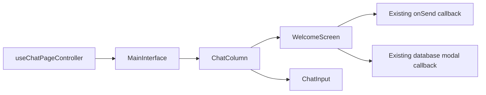

# Claude-Inspired Moonlit Welcome and Composer Design

## Status

Approved by the user on 2026-08-16. This document captures the agreed product and interaction
design. Implementation remains gated on the user's review of this written specification and a
subsequent implementation plan.

## Objective

Redesign Moonlit's authenticated empty-chat welcome experience and shared chat composer using the
layout discipline and interaction quality of Claude's welcome page while preserving Moonlit's own
database-focused identity, controls, behavior, and architecture.

The change should make the welcome state feel warmer and more intentional, give users useful
connection-aware starting points, and keep the same composer shell before and after the first
message.

## Reference Findings

The live Claude reference was inspected at a 1393 by 831 viewport. The relevant patterns are:

- A centered welcome stack with a roughly 672px-wide composer.
- A large conversational headline above the composer.
- A dark raised composer surface around 120px tall with a 20px radius, quiet inset boundary, and
  very soft shadow.
- A spacious prompt area above a single toolbar row.
- A centered category row with 8px gaps.
- Desktop category controls around 32px tall, with an 8px radius, icon-and-label layout, and 12px
  horizontal padding.
- Selecting a category replaces the category row with a bordered suggestion panel below the
  composer. The panel has a labeled header, a close control, and separated prompt rows.
- Motion is restrained: opacity, small vertical travel, and height/layout expansion rather than
  decorative effects.

These measurements guide the design but do not authorize copying Claude's branding, copy,
categories, icons, model controls, or sidebar.

## Approved Approach

Use a targeted shared-composer redesign:

1. Restyle the existing `ChatInput` shell so the Claude-inspired geometry remains consistent in
   both the welcome state and active conversations.
2. Retain Moonlit's existing composer footer controls and behavior.
3. Add a two-stage, connection-aware category and suggestion interaction to `WelcomeScreen`.
4. Keep the state local to the welcome feature and reuse the existing `onSend` path.
5. Add only the minimal callback plumbing needed for a connection suggestion to open Moonlit's
   existing database modal.

This approach is preferred over a separate welcome composer because it avoids duplicated message
entry logic and a visual jump after the first submission. It is preferred over a broad chat-shell
rebuild because the current component and state boundaries are sound.

## Visual Design

### Welcome Layout

- Keep the welcome content centered in the available chat column.
- Use a 672px maximum width for the shared composer and welcome suggestion panel, with responsive
  horizontal padding on narrower viewports. Transcript content keeps its existing 768px width.
- Preserve vertical scrolling for short viewport heights and long localized or personalized text.
- Keep the welcome stack visually quiet and free of unrelated cards, gradients, or decorative
  backgrounds.

### Time-Aware Greeting

The approved greeting format is:

> What are we exploring {time period}, {first name}?

The time period is derived from the user's local time with deterministic ranges:

- 05:00 through 11:59: `this morning`
- 12:00 through 16:59: `this afternoon`
- 17:00 through 20:59: `this evening`
- 21:00 through 04:59: `tonight`

When no first name is available, omit the comma and name and render a grammatically complete
question, such as `What are we exploring tonight?`.

Render the existing `/moonlit.svg` asset as a 32px decorative brand mark beside the greeting on
desktop and 28px on narrow layouts. It must have empty alternative text because the adjacent
heading already provides the meaningful label. Do not imitate Claude's starburst.

### Composer Shell

- Apply the same shared composer shell in both empty and active conversation states.
- Use a 20px desktop radius to match the approved reference direction.
- Use the existing `background.composer` semantic token (`#1a1c20`).
- Use a quiet inset hairline plus `0 4px 20px rgba(0, 0, 0, 0.08)`. Focus strengthens the inset
  boundary but must not create a second visible ring inside the component.
- Preserve a spacious prompt area above a single footer row.
- Preserve multiline growth, the current maximum row count, safe-area padding, and toolbar
  overflow behavior.
- Keep Moonlit's existing Context, SQL, effective task-mode, model, usage, Send, and Stop controls
  in their current functional order.
- Preserve all existing popovers, slash-command behavior, keyboard submission, streaming state,
  disabled state, and tooltips.

### Category Chips

- Place the category row directly below the welcome composer.
- On desktop, match the reference geometry: 32px high, 8px radius, 12px horizontal
  padding, 6px icon-to-label gap, and 8px between chips.
- Use Moonlit icons and labels rather than Claude's categories.
- Use a quiet filled or tonal surface with subtle hover and selected states; avoid prominent
  borders and saturated brand color.
- On touch layouts, preserve a minimum 44px interactive target even if the visible chip surface is
  visually compact.
- Allow wrapping without clipping or horizontal page overflow.

### Suggestion Panel

- Replace the category row with the panel rather than displaying both simultaneously.
- Align the panel to the composer's width and place it directly below the composer.
- Use `background.composer`, a subtle inset boundary, a 16px radius, and the same soft composer
  shadow.
- The header contains the selected category icon and label on the left and a semantic close button
  on the right.
- Render five suggestion rows for each category.
- Separate rows with subtle hairlines rather than individual card borders.
- Rows use left-aligned, concise prompt text and quiet hover/focus backgrounds.
- Long suggestions may wrap; the panel must remain readable and reachable on short/mobile
  viewports.

## Connection-Aware Content

### Connected State

Show these categories:

- **Explore schema**: prompts about tables, relationships, keys, data types, and schema summaries.
- **Write SQL**: prompts for drafting, explaining, optimizing, or validating read-only queries.
- **Analyze data**: prompts for trends, comparisons, anomalies, summaries, and useful breakdowns.
- **Moonlit's choice**: varied database exploration prompts chosen to demonstrate Moonlit's core
  capabilities without implying unsupported write access.

### Disconnected State

Show these categories:

- **Connect database**: actions and guidance for opening the existing connection flow and choosing
  a supported database.
- **Understand Moonlit**: prompts explaining supported databases, read-only execution, artifacts,
  model choice, and workflow.
- **Plan a query**: prompts that help formulate an analysis question or draft generic SQL without
  pretending schema context is available.
- **Moonlit's choice**: safe product-learning or analysis-planning prompts that do not require an
  active connection.

Suggestion copy must be maintained as structured data, not embedded in layout branches. Every
category contains exactly five entries so the panel behavior and visual rhythm remain predictable.
Entries may be either:

- A prompt action, which sends an exact string through the existing `onSend` callback.
- A local UI action, used only where a connection entry should open the existing database modal.

No suggestion may fabricate a connection, claim access to schema data while disconnected, or
imply that Moonlit can mutate the user's database.

## Interaction and Motion

### Category Selection

- Clicking or keyboard-activating a category selects it and replaces the chip row with its panel.
- The selected category is local presentation state; it must not enter global state or persist to
  storage.
- The panel header identifies the active category.

### Suggestion Activation

- Activating a prompt suggestion calls the existing `onSend` path once with the prompt text.
- Existing disabled or streaming guards remain authoritative.
- Activating a local connection action opens the existing database modal and does not create a
  chat message.
- Duplicate submission must not occur through simultaneous row and form handlers.

### Closing and Reset

- The close button restores the category row.
- `Escape` closes an open panel and returns focus to the category that opened it.
- The selection resets when the welcome state ends or remounts.
- No category selection persists after navigation to an existing conversation or after the first
  prompt creates a conversation.

### Keyboard Behavior

- Categories render as semantic buttons in an accessible named list. The suggestion panel renders
  as a named region containing a semantic list of buttons. Do not use tab, tabpanel, option, or
  listbox roles because the controls perform actions rather than changing document tabs or a
  selectable value.
- Arrow keys move among suggestions when the panel is focused.
- Home and End move to the first and last suggestion.
- Enter and Space activate the focused item.
- Tab order remains natural and must not trap focus.

### Animation

- Retain a short staggered fade-and-rise reveal for the initial welcome content.
- Category-to-panel transition combines opacity, no more than 6px vertical travel, and measured
  height/layout expansion.
- The reverse transition restores the chips without abrupt page movement.
- Use a 220ms ease-out transition for category/panel enter and exit motion.
- Do not introduce continuous animation.
- Under `prefers-reduced-motion: reduce`, remove translation and height animation; use an immediate
  state change or a short opacity-only transition.

## Architecture and Data Flow

Preserve the existing composition:

Responsibilities remain:

- `ChatInput.jsx`: composer rendering and current composer behavior.
- `WelcomeScreen.jsx`: greeting, connection-aware categories, local category state, suggestion
  panel, focus restoration, and suggestion activation.
- `interfaceChrome.js`: shared composer and welcome visual contracts.
- `welcomeSuggestions.js`: category definitions, action descriptors, and time-aware greeting logic.
- `ChatColumn.jsx` and `MainInterface.jsx`: minimal callback plumbing only when needed to open the
  existing database modal.

Do not add a provider, global store, context, event bus, new animation library, or backend endpoint.
The installed MUI and Framer Motion capabilities are sufficient; prefer the repository's existing
motion pattern and avoid adding dependencies.

## State and Error Handling

- Derive connected/disconnected content from the existing `isConnected` prop.
- If `onSend` is absent or the composer is disabled/streaming, prompt rows must not attempt a send.
- If the database-modal callback is unavailable, connection UI actions remain disabled with a
  clear accessible label rather than failing silently.
- The suggestion panel contains no asynchronous data fetching and therefore needs no loading
  state.
- Existing composer loading, disabled, model-loading, streaming, and error behavior remains
  unchanged.

## Accessibility

- Preserve one `h1` in the welcome state.
- Use semantic buttons for categories, suggestions, and close actions.
- Give the category collection and active suggestion panel accessible names.
- Use `aria-expanded`, `aria-controls`, and selected/current state only where they accurately
  describe the interaction.
- Announce the opened category without causing repeated live-region noise.
- Restore focus on close and never trap keyboard users in the panel.
- Maintain visible focus indicators and WCAG-appropriate contrast.
- Maintain 44px minimum touch targets on narrow layouts.
- Do not communicate connection state or selection using color alone.

## Responsive Behavior

- Desktop composer and suggestion panel use the existing maximum input width.
- Category chips center and wrap below the composer.
- On narrow screens, the composer and panel respect safe-area and chat-column padding.
- Toolbar scrolling must keep the model selector and Send/Stop control reachable.
- Suggestion text wraps without forcing horizontal overflow.
- On short heights, the welcome container scrolls so the panel's final row remains reachable.
- The active-conversation composer remains anchored using the current `ChatColumn` layout.

## Testing Strategy

### Focused Automated Tests

Test pure or component behavior using existing repository conventions:

- Greeting period selection at every time boundary and the missing-name fallback.
- Connected and disconnected category definitions.
- Every category exposes five valid actions.
- Category selection opens the correct panel.
- Closing resets selection and restores focus.
- Prompt activation calls `onSend` exactly once with the expected text.
- Connection action invokes the modal callback without calling `onSend`.
- Disabled/streaming states prevent prompt submission.
- Keyboard navigation supports arrows, Home, End, Escape, Enter, and Space.
- Reduced-motion styling removes translation/layout motion.

### Regression Validation

Run targeted tests first, then the relevant existing UI audits, ESLint, Knip, and the production
build. Any pre-existing failures must be distinguished from regressions introduced by this change.

### Browser Validation

Check the authenticated interface at representative mobile, breakpoint, and desktop sizes:

- Disconnected welcome state and connection category.
- Connected category content when a safe existing fixture is available.
- Initial welcome reveal and category-to-panel transition.
- Mouse and keyboard behavior, focus restoration, and Escape handling.
- Prompt submission creates one message and transitions to the active conversation composer.
- Composer geometry remains consistent between welcome and active conversation states.
- Empty, ready, disabled, streaming, and model-loading composer states.
- Wrapping, short-height scrolling, safe-area padding, and absence of horizontal overflow.
- Reduced-motion mode.
- Console errors and React warnings.

Do not connect to a real database, create persistent external data, or send a production prompt
solely to construct a browser fixture without separate authorization.

## Expected Files

- `front-end/src/features/chat/WelcomeScreen.jsx`
- `front-end/src/features/chat/ChatInput.jsx`
- `front-end/src/features/styles/interfaceChrome.js`
- `front-end/src/features/chat/welcomeSuggestions.js`
- `front-end/src/features/chat/welcomeSuggestions.test.js`
- `front-end/src/features/chat/ChatColumn.jsx`, only for callback plumbing
- `front-end/src/features/MainInterface.jsx`, only for callback plumbing
- Focused tests for greeting/content/interaction behavior
- Existing executable UI audits where the new visual contract can be asserted honestly

## Non-Goals

- Copying Claude's logo, starburst, copy, icons, category names, model controls, or sidebar.
- Replacing Moonlit's Context, SQL, task-mode, model, usage, Send, or Stop controls.
- Changing message submission, streaming, slash commands, model selection, database switching, SQL
  workspace, conversation persistence, or backend behavior.
- Adding suggestion personalization based on schema inspection, conversation history, analytics, or
  remote data.
- Adding continuous decorative animation.
- Refactoring unrelated chat, shell, sidebar, theme, or artifact code.
- Adding a dependency, global store, provider, or backend API.

## Acceptance Criteria

- The welcome state uses the approved time-aware Moonlit greeting with a correct no-name fallback.
- The shared composer uses the approved Claude-inspired shell in both welcome and active chat.
- All existing Moonlit composer controls and behavior remain functional.
- Connected and disconnected users see the approved categories for their state.
- Selecting a category transitions to a five-row suggestion panel matching the approved design.
- Prompt actions send once through the existing callback; connection actions open the existing
  modal without sending.
- Close, Escape, focus restoration, keyboard navigation, and reduced-motion behavior work.
- Mobile targets, wrapping, short-height reachability, and safe-area behavior remain correct.
- No backend/API behavior or unrelated UI changes.
- Targeted tests, relevant audits, lint, Knip, and build pass, apart from clearly documented
  pre-existing failures.
