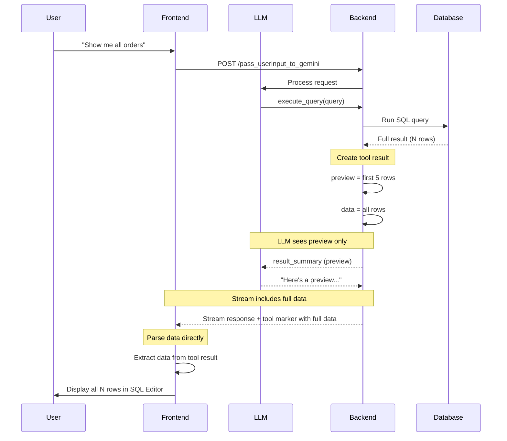

# Execute Query Flow

Documentation for the optimized query result flow that enables token-efficient LLM interactions while providing full data to the frontend.

## Overview

When the AI agent executes a SQL query, the system follows an embedded data architecture:
- **LLM receives**: Preview data (5 rows) via result_summary
- **Frontend receives**: Full data embedded in streamed tool result

This approach saves LLM tokens while keeping architecture simple (no cache, no extra API calls).

---

## Architecture Diagram



---

## Components

### Backend

| File | Purpose |
|------|---------|
| `services/tool_schemas.py` | `QueryResult` model with `preview` and `data` fields |
| `services/llm_service.py` | Sends `result_summary` (preview only) to LLM context |

### Frontend

| File | Purpose |
|------|---------|
| `MessageList.jsx` | Parses full `data` directly from tool result |
| `SQLEditorCanvas.jsx` | Displays results in table |

---

## Example Flow

### 1. User Request
```
User: "Show me top 10 customers by revenue"
```

### 2. Tool Result Structure
```json
{
  "success": true,
  "row_count": 10,
  "columns": ["customer_id", "name", "revenue"],
  "preview": [
    {"customer_id": 1, "name": "Acme Corp", "revenue": 50000},
    {"customer_id": 2, "name": "TechStart", "revenue": 45000},
    {"customer_id": 3, "name": "GlobalInc", "revenue": 42000},
    {"customer_id": 4, "name": "LocalBiz", "revenue": 38000},
    {"customer_id": 5, "name": "StartupXYZ", "revenue": 35000}
  ],
  "data": [
    {"customer_id": 1, "name": "Acme Corp", "revenue": 50000},
    {"customer_id": 2, "name": "TechStart", "revenue": 45000},
    ... all 10 rows ...
  ]
}
```

### 3. What LLM Sees (result_summary)
Only the preview (5 rows) for token efficiency.

### 4. What Frontend Parses
Full `data` array from the tool marker in the stream.

### 5. SQL Editor Shows Complete Results
All 10 rows displayed in the Results tab.

---

## Why No Cache?

### Previous Approach (Removed)
```
Backend → Cache full data in Redis → Return result_id
Frontend → Extra API call → GET /query-result/{id}
```

### Current Approach (Simpler)
```
Backend → Embed full data in tool result
Frontend → Parse directly from stream
```

### Comparison

| Factor | With Cache | Without Cache (Current) |
|--------|------------|------------------------|
| API calls | 2 per query | 1 per query |
| Architecture | Complex | Simple |
| Cost at scale | Expensive | Free |
| Dependencies | Redis cache service | None |

---

## Benefits

1. **Token Efficiency**: LLM context only has 5 preview rows
2. **Full Data Access**: Users get complete results in SQL Editor
3. **Simple Architecture**: No cache, no extra API calls
4. **Cost Effective**: No Redis bandwidth costs for large results
