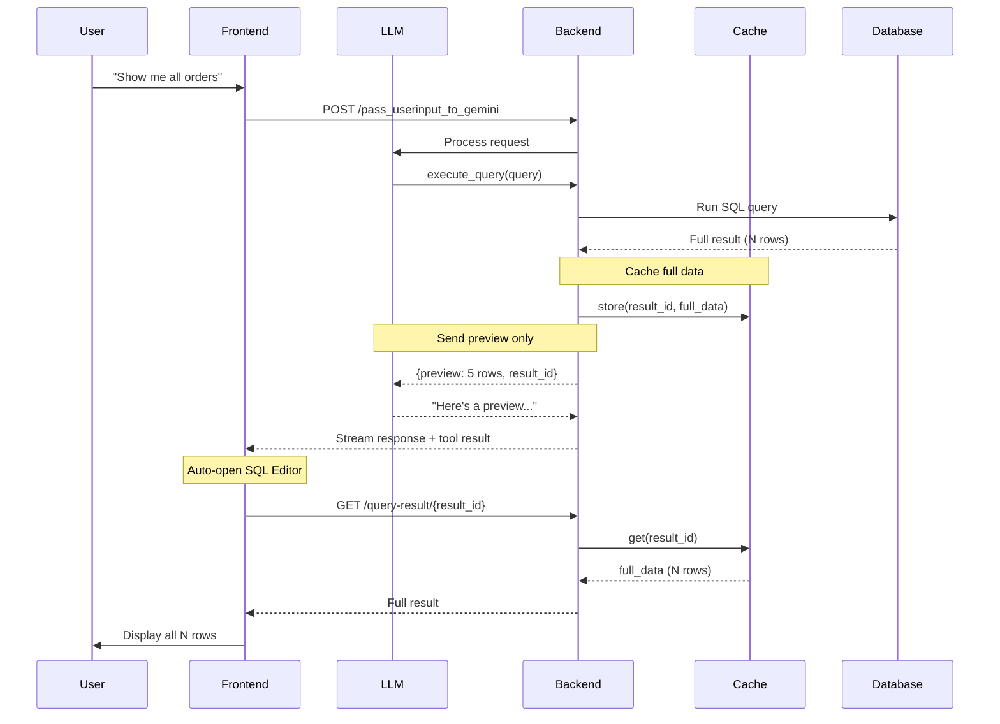

# Execute Query Cache Flow

Documentation for the optimized query result caching system that enables token-efficient LLM interactions while providing full data to the frontend.

## Overview

When the AI agent executes a SQL query, the system follows a cache-based architecture:
- **LLM receives**: Preview data (5 rows) + `result_id`
- **Frontend receives**: Full data fetched from cache via `result_id`

This approach saves LLM tokens while ensuring users see complete query results.

---

## Architecture Diagram



---

## Components

### Backend

| File | Purpose |
|------|---------|
| `services/result_cache.py` | In-memory cache with 5-min TTL |
| `services/tool_schemas.py` | `QueryResult` model with `result_id` |
| `api/routes.py` | `GET /query-result/{id}` endpoint |
| `services/llm_service.py` | System prompt with preview guidance |

### Frontend

| File | Purpose |
|------|---------|
| `MessageList.jsx` | Fetches full data via `result_id` on tool completion |
| `SQLEditorCanvas.jsx` | Displays results in table |
| `vite.config.js` | Proxy for `/query-result` endpoint |

---

## Example Flow

### 1. User Request
```
User: "Show me top 10 customers by revenue"
```

### 2. LLM Receives (Token-Efficient)
```json
{
  "success": true,
  "row_count": 10,
  "columns": ["customer_id", "name", "revenue"],
  "preview": [
    {"customer_id": 1, "name": "Acme Corp", "revenue": 50000},
    {"customer_id": 2, "name": "TechStart", "revenue": 45000},
    {"customer_id": 3, "name": "GlobalInc", "revenue": 42000},
    {"customer_id": 4, "name": "LocalBiz", "revenue": 38000},
    {"customer_id": 5, "name": "StartupXYZ", "revenue": 35000}
  ],
  "result_id": "a1b2c3d4-5678-90ab-cdef"
}
```

### 3. LLM Response
```
Here's a preview of the top customers by revenue. 
You can see all 10 results in the Result section.

| Customer | Revenue |
|----------|---------|
| Acme Corp | $50,000 |
| TechStart | $45,000 |
| GlobalInc | $42,000 |
| ... | ... |
```

### 4. Frontend Fetches Full Data
```javascript
// MessageList.jsx - on tool completion
const response = await fetch(`/query-result/${resultId}`);
const fullData = await response.json();
// fullData contains all 10 rows
```

### 5. SQL Editor Shows Complete Results
All 10 rows displayed in the Results tab.

---

## Cache Behavior

| Property | Value |
|----------|-------|
| TTL | 5 minutes |
| Storage | In-memory (per-server) |
| Fallback | Preview data from tool result |

### Cache Miss Handling
If cache fetch fails (expired or server restart):
1. Frontend falls back to preview data from tool result
2. User sees 5 rows instead of full result
3. No error shown - graceful degradation

---

## System Prompt Guidance

The LLM is instructed to inform users about preview limits:

```
When execute_query returns results:
- You receive a PREVIEW (first 5 rows) for context efficiency
- Full results are automatically available in the Result section
- If row_count > 5, inform the user naturally:
  "Here's a preview of the results. You can see all X rows in the Result section."
```

---

## Benefits

1. **Token Efficiency**: LLM context only has 5 preview rows, not full dataset
2. **Full Data Access**: Users get complete results in SQL Editor
3. **Graceful Fallback**: Preview available if cache fails
4. **Transparent UX**: Agent informs users about preview limit
